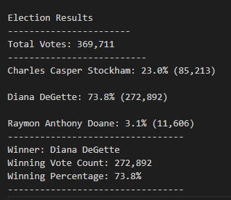

# Election Analysis

## Project Overview
The purpose of this module is to find extract the candidates who ran in the election. Then tally the amount of total votes, the amount of votes each candidate received, the percentage of votes each candidate received, and who won the election. 

## Resources
Data source: election_results.csv  
Progam: Python 3.7 and Visual Studio Code

## Results

There were 369,711 votes casted.  
The candidates were:  
    -Charles Casper Stockham  
    -Diana Degette  
    -Raymon Anthony Doane  
The candidate results were:  
    -Charles Casper Stockham: 23.0% (85,213)  
    -Diana Degette: 73.8% (272,892)  
    -Raymon Anthony Doane: 3.1% (11,606) 
The winner was:  
    -Diana Degeette who recieved 73.8% of the vote and 272,892 number of votes
## Challenges
Some challenges of going through this module was understanding why we did the things we did. To start, the way the module jumped around was confusing because sometimes it was hard knowing where the new code we were adding should go. Also, another challenge I had was using "white space", just a simple indenting error could throw off the entire result. I would say this was a great module to under
## Challenge Overview

## Challenge Summary

