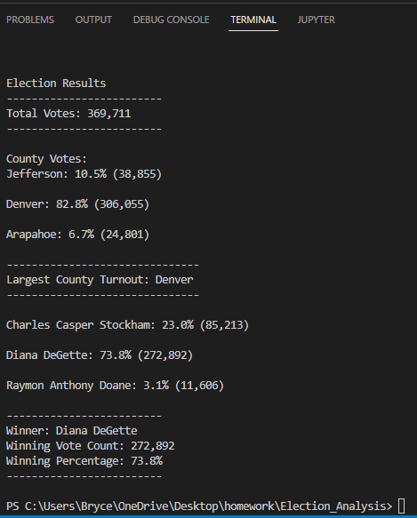
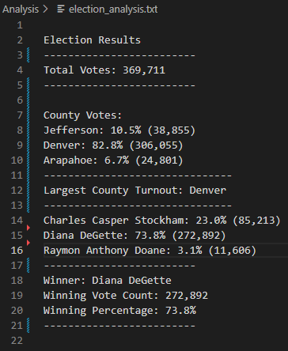
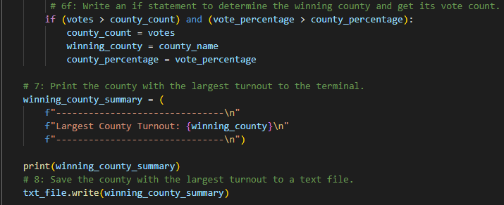

# Election Analysis

## Project Overview
The purpose of this election analysis is to extract data from the election_results.csv file. The CSV file holds over 300,000 lines of data and our job is to break it down to see the following:
* The total votes casted
* What counties the votes came from
* The percentage and votes casted per county
* What county had the largest turnout
* The candidates that ran in the election 
* The percentage and votes the candidates received
* The winner of the election

## Resources
Data source: election_results.csv  
Progam: Python 3.7 and Visual Studio Code

## Results
Deliverable 1.  

Deliverable 2.  
  
I was able to post the results in the terminal by using the print() command. To get the results into the text file you need to use the .write command. 
 

## Challenges
Some challenges of going through this module was understanding why we did the things we did. To start, the way the module jumped around was confusing because sometimes it was hard knowing where the new code we were adding should go. Also, another challenge I had was using "white space", just a simple indenting error could throw off the entire result. I would say this was a great module to under
## Challenge Overview

## Challenge Summary

